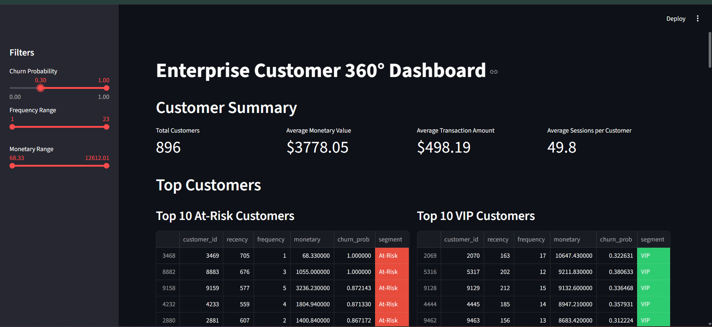
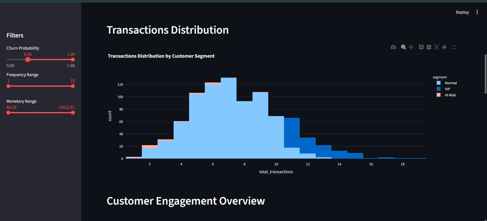
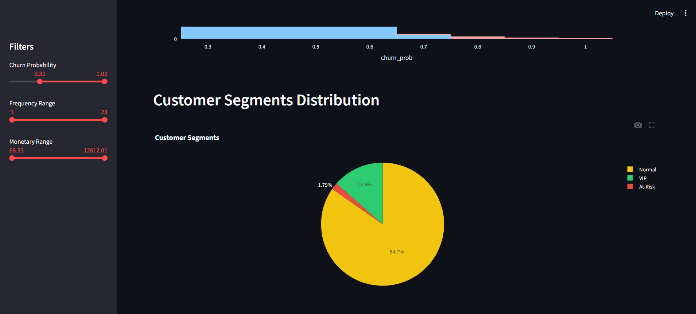

# Enterprise Customer 360° Data Platform


---

## 🔹 Project Overview

Built a **Customer 360° platform** that integrates multiple datasets — transactions, web logs, and support tickets — into a **single source of truth** for actionable customer insights. Developed ETL pipelines, feature engineering, and an **interactive Streamlit dashboard** to visualize KPIs, churn probability, and customer segmentation.

This project demonstrates **real-world data engineering, business analytics, and machine learning skills** in a single end-to-end workflow.

---

## 🔹 Features

- **ETL Pipeline:** Bronze → Silver → Gold layers for reproducible workflows.
- **Data Cleaning & Preprocessing:** Handle missing values, duplicates, inconsistent formats.
- **Feature Engineering:** Calculate RFM scores, Customer Lifetime Value (CLV), and churn probability.
- **Machine Learning:** RandomForestClassifier for churn prediction (model generated dynamically).
- **Interactive Dashboard:** Streamlit + Plotly visualizations including:
  - Top 10 At-Risk & VIP customers
  - Transactions distribution
  - Customer engagement & campaign performance
  - Churn probability and segmentation
- **Business Insights:** Enables marketing, finance, and operations teams to make data-driven decisions.

---

## 🔹 Project Structure

Customer360/
│
├── app.py # Streamlit dashboard
├── etl/ # ETL scripts & model training
│ ├── generate_fake_data.py
│ ├── create_silver.py
│ ├── create_gold.py
│ └── train_model.py
├── data/
│ ├── bronze/ # Raw data placeholders
│ ├── silver/ # Cleaned data placeholders
│ └── gold/ # Master data placeholders
├── model/ # Trained model (.pkl, ignored in GitHub)
├── requirements.txt
├── README.md
└── .gitignore

yaml
Copy code

---

## 🔹 How to Run

1. **Generate fake data**
```bash
python etl/generate_fake_data.py
Clean & transform data

bash
Copy code
python etl/create_silver.py
python etl/create_gold.py
Train churn prediction model

bash
Copy code
python etl/train_model.py
Launch interactive dashboard

bash
Copy code
streamlit run app.py
🔹 Screenshots / Demo
## 🔹 Screenshots / Dashboard Demo

### 1️⃣ Customer 360° Dashboard Overview


### 2️⃣ Transactions Distribution


### 3️⃣ Customer Segments Distribution



Interactive Customer 360° Dashboard showing KPIs, churn prediction, and customer segmentation.

💡 Tip: Replace with a GIF to show interactive hover effects, filters, and charts.

🔹 Key Metrics Displayed in Dashboard
Metric	Description
Total Customers	Total number of unique customers
Avg Monetary Value	Average total money spent per customer
Avg Transaction Amount	Average purchase value
Avg Sessions per Customer	Average number of site/app sessions
Top 10 At-Risk Customers	Customers most likely to churn
Top 10 VIP Customers	High-value loyal customers
Customer Engagement	Total tickets, sessions, unique pages visited
Campaign Engagement	Emails opened, links clicked, campaigns received
Churn Probability	Predicted likelihood of churn per customer

🔹 Skills Demonstrated
Python & Pandas – ETL, data cleaning, transformations

Data Warehousing – Bronze/Silver/Gold layers

Feature Engineering – RFM scores, CLV, churn probability

Machine Learning – RandomForestClassifier for churn prediction

Dashboarding – Streamlit + Plotly interactive visualizations

Business Analytics – Customer segmentation, campaign engagement, actionable KPIs

🔹 License
This project is open-source and free to use for portfolio/demo purposes.

🔹 Optional Enhancements
Add Plotly hover info and colored bars for better interaction

Include customer segments distribution pie chart

Add churn probability slider for dynamic filtering

Showcase top 10 VIP vs top 10 At-Risk customers in separate tables

yaml
Copy code

---
